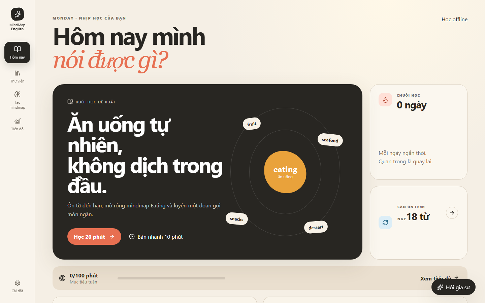

# MindMap English Local AI

Ứng dụng học từ vựng tiếng Anh local-first bằng **mindmap tương tác, SRS, quiz, AI gia sư và luyện nói từng câu**. Thiết kế cho người học cơ bản muốn tiến tới B1-B2 theo hướng thực dụng.



## Tính năng

- Dashboard **Học hôm nay** với buổi 10 hoặc 20 phút.
- 17 chủ đề đời sống và mindmap Eating mẫu.
- Mindmap React Flow: zoom, pan, kéo node, Focus Mode, list fallback.
- Một lịch SRS trung tâm cho mỗi từ.
- Quiz nhớ nghĩa, ngữ cảnh, collocation, nghe và nói.
- AI Agent qua 9Router; core learning vẫn chạy offline.
- AI tạo mindmap dưới dạng draft, bắt buộc duyệt trước khi lưu chính thức.
- Push-to-talk STT và TTS đọc câu mẫu.
- SQLite local, backup ZIP, restore staging an toàn.
- Responsive desktop/mobile, keyboard focus, reduced motion.

## Stack

- React 19 + Vite 8 + TypeScript strict.
- Express 5 modular monolith.
- SQLite qua better-sqlite3.
- Zod contracts.
- React Flow.
- Vitest, Testing Library, Supertest, Playwright.

## Yêu cầu

- Node.js 22 trở lên.
- npm 10 trở lên.
- 9Router tùy chọn cho AI, STT, TTS và image generation.

## Cài đặt nhanh

```powershell
git clone <repository-url>
cd MindMap_English
npm install
Copy-Item .env.example .env
npm run build
npm start
```

Mở `http://127.0.0.1:8787`.

Không cấu hình 9Router vẫn dùng được thư viện, mindmap, quiz, SRS, tiến độ và backup.

## Cấu hình `.env`

| Biến | Mặc định | Mục đích |
|---|---|---|
| `HOST` | `127.0.0.1` | Chỉ bind local |
| `PORT` | `8787` | Cổng API và production UI |
| `DATA_DIR` | `./data` | SQLite, media, backup |
| `NINEROUTER_URL` | `http://localhost:20128` | 9Router gateway |
| `NINEROUTER_KEY` | trống | Key nếu gateway bật auth |
| `NINEROUTER_CHAT_MODEL` | trống | Tutor và tạo mindmap |
| `NINEROUTER_IMAGE_MODEL` | trống | Minh họa AI |
| `NINEROUTER_STT_MODEL` | trống | Speech-to-text |
| `NINEROUTER_TTS_MODEL` | trống | Text-to-speech model |
| `NINEROUTER_TTS_VOICE` | trống | Voice ID ưu tiên |

## Lệnh

```powershell
npm run dev          # client + server development
npm run build        # production client build
npm start            # local production server
npm test             # unit/integration/component tests
npm run test:e2e     # Playwright desktop/mobile
npm run typecheck    # TypeScript strict
npm audit --audit-level=moderate
```

## Dữ liệu

```text
data/
├── mindmap-english.db
├── media/
└── backups/
```

`data/`, `.env`, PDF/DOCX nguồn và API key đều bị loại khỏi Git.

## Tài liệu tiếng Việt

- [Hướng dẫn sử dụng](docs/vi/huong-dan-su-dung.md)
- [Kiến trúc và phát triển](docs/vi/kien-truc-va-phat-trien.md)
- [Tích hợp 9Router](docs/vi/tich-hop-9router.md)
- [Design specification](docs/superpowers/specs/2026-07-13-mindmap-english-local-ai-design.md)
- [Implementation plan](docs/superpowers/plans/2026-07-13-mindmap-english-local-ai-implementation.md)

## Kiểm thử hiện tại

- 25 unit/integration/component tests.
- 3 Playwright E2E tests trên desktop/mobile; 1 case desktop skip có chủ đích cho test mobile-only.
- TypeScript strict pass.
- Production build pass.
- npm audit: 0 vulnerabilities.

## Quyền riêng tư

- Server bind localhost.
- Key 9Router không gửi ra browser.
- Audio chỉ gửi khi người dùng chủ động ghi âm.
- AI output validate bằng Zod và lưu draft trước.
- Không log API key hoặc raw audio.

## Roadmap

- Chỉnh sửa nội dung node đầy đủ trong UI.
- Cache audio và ảnh theo từ.
- Image generation có style guide thống nhất.
- Hội thoại voice realtime.
- PWA offline cache có versioning.
- Đồng bộ nhiều thiết bị tùy chọn.

## Mở rộng học từ 3 nguồn

- **Từ điển offline:** gợi ý tối đa 6 từ, tra exact, sửa lỗi gõ và kiểm tra từ đã có trong thư viện. Có thể nạp danh sách lớn từ `data/dictionary/words.txt`; nếu thiếu file, app dùng vocabulary local và seed tích hợp.
- **Phòng luyện shadowing:** lưu câu vào sổ, nghe TTS, ghi âm qua STT hoặc nhập transcript thủ công, so sánh từ thiếu/thừa/thay thế và hoàn tất buổi luyện. Điểm hiển thị là độ khớp nội dung, không phải điểm phát âm.
- **Bàn đọc cá nhân:** nhập TXT, Markdown hoặc EPUB tối đa 5 MB, đọc theo section/chapter, chỉnh cỡ chữ/giãn dòng, chọn đoạn để tạo thẻ từ, lưu sổ câu, prefill mindmap draft hoặc hỏi gia sư với provenance chính xác.
- **AI extraction draft:** phân tích section đã chọn thành nhóm `recommended`, `optional`, `skip`. Kết quả luôn là bản nháp; không tự ghi vào vocabulary, mindmap hoặc SRS.

Thư mục dữ liệu mới:

```text
data/
├── dictionary/words.txt   # tùy chọn
├── documents/<checksum>/  # tài liệu nhập local
├── mindmap-english.db
├── media/
└── backups/
```

## Kiểm thử hiện tại

- 22 file test, 64 unit/integration/component tests pass.
- 5 Playwright scenarios pass trên desktop/mobile; 1 desktop case skip có chủ đích vì mobile-only.
- TypeScript strict và production build pass.
- `npm audit --audit-level=moderate`: 0 vulnerabilities.

## Tài khoản và AI tutor

- Đăng ký bằng `username + password`; mỗi tài khoản có dữ liệu học, tài liệu và hội thoại riêng trong SQLite.
- Recovery code chỉ hiển thị khi đăng ký hoặc khôi phục mật khẩu. User phải tự lưu; code cũ bị vô hiệu sau khi dùng.
- AI tutor dùng skill `.hermes/skills/mindmap-english-tutor/SKILL.md`, learner context đã giới hạn từ SQLite và lịch sử chat nhiều thread.
- Cache chỉ áp dụng cho learner context và câu hỏi kiến thức độc lập; hội thoại nối tiếp luôn gọi AI.
- Mutation API kiểm tra same-origin, session cookie dùng `HttpOnly` và `SameSite=Lax`.

### Đóng gói lên VPS

- Chạy sau reverse proxy HTTPS và đặt cấu hình production để cookie có `Secure`.
- Không public trực tiếp SQLite, `DATA_DIR`, thư mục media hoặc backup. Chỉ user chạy service được quyền đọc/ghi `DATA_DIR`.
- Giữ `NINEROUTER_KEY` trong biến môi trường phía server; không đưa vào bundle frontend.
- Backup `DATA_DIR` trước migration hoặc deploy phiên bản mới.

## License

Xem [LICENSE](LICENSE).
