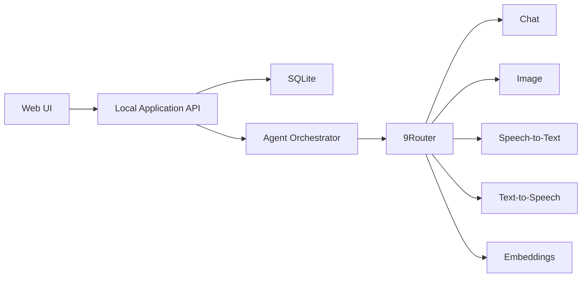

# MindMap English Local AI — Design Specification

## 1. Product Summary

MindMap English Local AI is a single-user local web application for practical English learning from beginner level toward B1-B2. It combines interactive vocabulary mindmaps, spaced repetition, quizzes, an AI tutor, AI-assisted mindmap creation, and sentence-level speaking practice.

SQLite stores local data. 9Router provides chat, image generation, speech-to-text, text-to-speech, and optional embeddings. The product starts as a localhost web application and may later become a local PWA.

## 2. Learning Principles

The source book is a methodological and topic reference, not content to reproduce. Its learning pattern becomes:

`central topic → association → vocabulary groups → illustration → pronunciation → contextual dialogue`

Product priorities:

- Practical daily vocabulary and collocations.
- Short, natural examples aimed at B1-B2.
- Vietnamese support for beginner-level comprehension.
- Listening, speaking, recognition, recall, and contextual use.
- Adaptive difficulty based on observed performance.
- Retention over raw vocabulary count.

Initial themes may cover eating, drinking, home, leisure, sports, moods, transportation, body parts, holidays, numbers, love, people, appearance, animals, nature, and related daily-life topics.

## 3. User and Constraints

- One personal learner.
- Current level: beginner.
- Target: practical B1-B2.
- Default study duration: 20 minutes.
- Quick study duration: 10 minutes.
- Local-first storage and execution.
- No account required.
- Core learning works without AI or internet.
- AI access routes through 9Router.
- Desktop-first design with core tablet/mobile support.

## 4. Delivery Strategy

Build complete vertical slices:

1. Core Learning: dashboard, library, mindmaps, local API, SQLite.
2. Retention: quizzes, SRS, history, progress.
3. Creation: AI drafts, editing, approval, persistence.
4. Tutor: learning-aware Agent and adaptive sessions.
5. Voice: push-to-talk STT, feedback, TTS.
6. Polish: PWA, light gamification, export, backup, recovery.

Each slice must leave the application usable.

## 5. Information Architecture

Primary navigation:

`Today | Library | Create Mindmap | Progress`

AI Tutor opens as a drawer rather than occupying permanent width.

### Today

- Primary `Study Today` action.
- Choose 10-minute or 20-minute session.
- Due review count, weekly progress, streak.
- Resume unfinished session.

### Library

- Curated starter topics.
- Approved AI-generated mindmaps.
- User-created mindmaps.
- Personal vocabulary collections.
- Search by topic, CEFR, and learning status.

### Create Mindmap

`topic → scope clarification → AI draft → duplicate check → visual editing → approval → save`

### Progress

- New, learning, weak, and stable vocabulary.
- Retention after 1, 7, and 30 days.
- Topic coverage.
- Listening, speaking, and sentence-creation activity.
- Weekly goals and history.

### Settings

- 9Router URL and capability models.
- Secure key setup guidance.
- TTS voice and default session duration.
- Backup, export, import, and restore.

## 6. Technical Architecture

Use a local modular monolith: one browser UI, one local backend API, one SQLite database, and explicit internal modules.

Modules:

- `learning`: 10/20-minute sessions.
- `mindmaps`: maps, nodes, branches, layout, editing.
- `vocabulary`: terms, meanings, IPA, collocations, examples.
- `reviews`: SRS cards, attempts, grades, due dates.
- `tutor`: Agent threads, prompts, tools, guidance.
- `speech`: recordings, STT, TTS, feedback.
- `content-generation`: jobs, drafts, validation, approval.
- `settings`: local preferences and 9Router configuration.
- `backup`: export, import, snapshots, recovery.

Rules:

- Browser code never receives the 9Router key.
- Backend binds to localhost by default.
- AI never writes directly to canonical learning data.
- Tool workflows require validated structured JSON.
- Images and audio live as files; SQLite stores metadata and paths.
- AI capability adapters prevent provider lock-in.
- Core learning continues when 9Router is unavailable.

## 7. SQLite Data Model

Content tables:

- `topics`
- `mindmaps`
- `mindmap_nodes`
- `vocabulary`
- `examples`
- `collocations`
- `media`

Learning tables:

- `learning_sessions`
- `session_items`
- `review_cards`
- `review_attempts`
- `speech_attempts`
- `user_progress`

Agent and generation tables:

- `agent_threads`
- `agent_messages`
- `generation_jobs`
- `draft_revisions`
- `settings`

Key relationships:

- One topic has many mindmaps.
- One mindmap has many nodes.
- One vocabulary record may appear in many mindmap nodes.
- One vocabulary record has one central review card.
- One session has many session items.
- One Agent thread has many messages.
- Draft revisions stay separate from approved records.

Vocabulary identity is separate from mindmap layout, preventing duplicate SRS schedules.

## 8. AI Agent

Agent role: tutor and workflow coordinator, not general chat.

Tools:

- `get_due_reviews`
- `get_learning_profile`
- `build_session`
- `generate_mindmap_draft`
- `generate_examples`
- `evaluate_answer`
- `evaluate_speech`
- `schedule_reviews`
- `search_vocabulary`
- `save_approved_draft`

`save_approved_draft` requires explicit approval state.

### Study Today Flow

1. Read due reviews, weaknesses, and weekly goals.
2. Build approximately 60% review and 40% new material.
3. Group material around one topic or situation.
4. Present mindmap exploration.
5. Test recognition, recall, listening, collocations, and sentence use.
6. Add push-to-talk practice when enabled.
7. Grade each item and update SRS.
8. Summarize the three most important errors.

### Agent Guardrails

- Never save unapproved generated content.
- Never delete data automatically.
- Never change 9Router settings automatically.
- Mark uncertain pronunciation or meaning for review.
- Keep examples short, natural, and practical.
- Preserve current session during model failure.
- Do not claim pronunciation accuracy beyond STT evidence.

## 9. Learning and SRS

Each vocabulary item has one shared review card.

Grades:

- `Again`: forgotten or incorrect.
- `Hard`: slow recall or hints required.
- `Good`: correct within expected time.
- `Easy`: fast recall and correct contextual use.

The scheduler combines learner grade with correctness, response time, hint use, listening performance, sentence creation, and repeated errors.

Exercise types:

1. Image to word.
2. Audio to meaning.
3. Meaning to typed word.
4. Sentence gap fill.
5. Natural collocation selection.
6. Model-sentence repetition.
7. Situation-based sentence creation.
8. Branch recall from a central node.

Ten-minute session:

- 2 minutes due review.
- 4 minutes weak vocabulary.
- 2 minutes listening or speaking.
- 2 minutes final quiz.

Twenty-minute session:

- 3 minutes SRS review.
- 6 minutes mindmap exploration.
- 5 minutes contextual practice.
- 4 minutes listening and speaking.
- 2 minutes summary.

Retention and practical use are primary. XP and streaks are secondary feedback.

## 10. Voice

MVP voice uses push-to-talk for one sentence:

1. Show a target situation.
2. Record one sentence.
3. Send audio through 9Router STT.
4. Compare transcript with intended meaning.
5. Correct grammar and natural expression.
6. Play a corrected model through TTS.
7. Allow retry.

Realtime continuous voice conversation is deferred.

## 11. Visual Design

Design read: adult personal learning app, modern focused shell, lively illustrated mindmaps, encouraging but not childish.

- `DESIGN_VARIANCE: 7`
- `MOTION_INTENSITY: 4`
- `VISUAL_DENSITY: 5`

Layout:

- Mindmap canvas owns primary area.
- Left navigation collapses during study.
- AI Tutor uses a drawer.
- Focus Mode hides nonessential UI.
- Session bar shows time, progress, pause, and finish.
- Mobile prioritizes branch lists and focused-node study.

Visual language:

- Warm off-white background and charcoal text.
- Distinct green, orange, blue, violet, and coral branches.
- SRS status uses labels/symbols, not color alone.
- Organic connections with stable node sizing.
- Notebook texture only inside canvas.
- Consistent illustration style.
- No generic AI gradients, excessive glass, or equal-card grids.

Vocabulary nodes show term, IPA, audio, short Vietnamese meaning, illustration, learning status, collocations, and examples.

Accessibility:

- Keyboard navigation and visible focus.
- Sufficient contrast.
- Meaning never depends only on color.
- Motion lasts about 150-250 ms.
- No looping decorative animation.
- Respect `prefers-reduced-motion`.

## 12. Offline and Failures

When 9Router is offline:

- Library, mindmaps, quizzes, and SRS remain usable.
- UI marks AI offline.
- Generation jobs remain queued.
- Current sessions continue.
- Cached TTS remains playable.

Capability fallback:

- Chat uses configured 9Router fallback.
- Image failure uses consistent placeholders.
- STT failure offers text input.
- TTS failure shows IPA and retry.
- Invalid AI JSON is rejected and repaired.
- Duplicate generated vocabulary requires merge/review.

Recovery:

- Sessions save checkpoints.
- Unfinished sessions resume.
- AI jobs use explicit states and idempotent retries.
- Retries do not duplicate canonical data.

## 13. Data Safety and Security

- Enable SQLite foreign keys.
- Use transactions for multi-record writes.
- Support automatic daily backups and configurable retention.
- Full export contains SQLite, media, and manifest.
- Import validates schema and creates a backup first.
- Use trash state before permanent deletion.
- Store secrets in environment variables or OS-supported local secret storage.
- Exclude keys and unnecessary raw personal data from logs.
- Send audio/images only for explicit feature actions.
- Identify active provider capability before media transmission.

## 14. MVP Scope

Included:

- Local dashboard.
- Topic library.
- Interactive editable mindmaps.
- 10/20-minute sessions.
- Quiz and SRS.
- AI mindmap drafts with approval.
- Learning-aware Tutor.
- Push-to-talk STT.
- TTS playback.
- Basic progress.
- Backup and restore.

Deferred:

- Realtime voice conversation.
- Multi-device sync.
- Multiple accounts.
- Shared marketplace.
- Native mobile app.
- Complex achievement economy.
- Publishing unreviewed AI content.

## 15. Validation

Unit tests:

- SRS scheduling and grading.
- Session composition.
- Streak calculation.
- Input and AI-output validation.

Integration tests:

- SQLite transactions and repositories.
- Agent tool permissions.
- 9Router adapters.
- Backup and restore.

Contract tests:

- Structured chat responses.
- Mindmap draft schema.
- STT/TTS responses.
- Timeout and fallback behavior.

End-to-end tests:

- Create/edit/reopen mindmap.
- Complete study session.
- Grade answers and schedule reviews.
- Generate/edit/approve/save AI draft.
- Record a sentence, receive feedback, play TTS.
- Resume interrupted session.

Failure tests:

- 9Router offline.
- Model timeout.
- Invalid AI JSON.
- Locked SQLite database.
- Missing media.
- Interrupted generation job.

Accessibility and responsive tests cover keyboard, focus, contrast, reduced motion, desktop, tablet, and core mobile flow.

## 16. Acceptance Criteria

MVP is accepted when:

- App opens locally without an account.
- Mindmaps can be created, edited, saved, and reopened.
- A 10-minute or 20-minute session completes.
- SRS updates correctly after answers.
- Agent builds sessions from actual progress.
- AI mindmaps remain drafts until approval.
- One sentence can be transcribed, corrected, and replayed with TTS.
- Core study works while 9Router is offline.
- Backup and restore preserve records and media references.

## 17. Non-Goals

- Reproduce source-book pages or visual design.
- Act as a general AI chat client.
- Support schools, classes, or multiple learners initially.
- Maximize vocabulary count without retention evidence.
- Present transcript-only analysis as professional pronunciation scoring.
