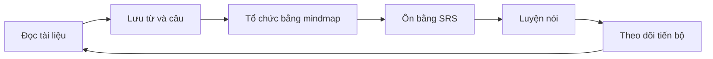

# Three-Source Learning Expansion — Design Specification

## 1. Mục tiêu

Mở rộng MindMap English Local AI bằng ba nguồn ý tưởng hợp thành một vòng học thống nhất:

- `dwyl/english-words`: kiểm tra từ offline, autocomplete và phát hiện lỗi chính tả.
- `ZuodaoTech/everyone-can-use-english`: shadowing, đọc thành tiếng và tự luyện theo câu.
- `hehonghui/awesome-english-ebooks`: tham khảo cho thư viện tài liệu cá nhân và luồng trích nội dung thành bài học.

Ứng dụng không sao chép nguyên code hoặc phân phối nội dung từ ba repository. Mỗi nguồn chỉ cung cấp dữ liệu được phép dùng, phương pháp học hoặc tham khảo sản phẩm.

## 2. Design Direction

Giữ ngôn ngữ visual hiện tại: editorial ấm, trưởng thành, tập trung, ít game hóa.

- Design variance: 6/10.
- Motion intensity: 4/10.
- Visual density: 5/10.

Giữ nền giấy kem, cam san hô, panel than đen, typography editorial, border nâu nhạt và hướng dẫn tiếng Việt. Tránh dashboard SaaS dày card, XP, pháo giấy, mascot, gradient tím AI, glassmorphism diện rộng và ba visual system riêng.

## 3. Information Architecture

Navigation chính: `Hôm nay | Thư viện | Phòng luyện | Tiến độ`.

- `Hôm nay`: buổi học gợi ý, SRS đến hạn, hoạt động chưa hoàn thành.
- `Thư viện`: mindmap, tài liệu cá nhân và nội dung đã lưu.
- `Phòng luyện`: vocabulary recall, sentence practice, shadowing và read-aloud.
- `Tiến độ`: retention, phút luyện nghe/nói/đọc và lịch sử.

`Tạo mindmap` trở thành action trong Thư viện. Dictionary là capability ngầm trong editor, import và AI draft; không phải destination chính. Settings vẫn nằm trong app shell. AI Tutor tiếp tục là drawer hoặc contextual action.

## 4. Vòng học thống nhất



Object chung: Word, Sentence, Source, Practice và Progress. Vocabulary canonical giữ một lịch SRS duy nhất; sentence luôn phân biệt nguồn, nội dung người dùng và nội dung AI đã duyệt.

## 5. Phase 1 — Offline Dictionary Assistance

- Word existence lookup offline.
- Autocomplete tối đa sáu kết quả.
- Gợi ý sửa lỗi chính tả gần đúng.
- Kiểm tra từ trong mindmap editor, document extraction và AI draft.
- Cho phép override cho tên riêng, từ chuyên ngành, biến thể hoặc cụm hợp lệ.

Không nhập toàn bộ word list vào `vocabulary`. Word index nằm trong storage riêng; chỉ vocabulary được duyệt mới tham gia SRS.

UX: từ hợp lệ không thêm badge; từ đáng ngờ dùng underline chấm cam; lỗi chắc chắn có action `Dùng từ này`; từ chưa biết có badge `Cần kiểm tra`; từ đã tồn tại mở vocabulary hiện có. Autocomplete hỗ trợ bàn phím, tối đa sáu dòng và không che input trên mobile.

Module dự kiến: `src/server/modules/dictionary/`. Capability gồm load index, normalize Unicode/lowercase/spacing, exact lookup, prefix lookup và bounded typo suggestion. Lookup cơ bản không gọi AI.

## 6. Phase 2 — Speaking Practice Room

- Sentence notebook, TTS câu mẫu, push-to-talk, STT transcript.
- Deterministic diff với từ thiếu, thừa hoặc thay thế.
- Shadowing retry loop và theo dõi phút nghe, nói, đọc.

Không gọi transcript match là pronunciation score. Chấm phát âm âm vị nằm ngoài phạm vi khi chưa có acoustic scoring provider.

Desktop dùng workspace full-focus hai vùng: câu mục tiêu/recording và transcript/feedback. Mobile dùng một nhiệm vụ mỗi bước: đọc, nghe, nói, xem feedback, thử lại hoặc tiếp tục.

Nút ghi âm có label rõ: `Giữ để nói`, `Đang nghe…`, `Đang phân tích…`, `Nói lại`. Không dùng waveform lớn.

Feedback tối đa ba nhận xét, không phụ thuộc chỉ màu, không tô xanh toàn bộ từ đúng. AI tutor chỉ coaching sau deterministic diff. Progress gồm phút luyện, câu hoàn thành, retry, content match và transcript gần nhất. Không dùng XP hoặc leaderboard.

## 7. Phase 3 — Personal Reading Library

Thứ tự format: TXT/Markdown, EPUB, rồi PDF nếu extraction đủ ổn định. Người dùng tự cung cấp tài liệu hợp pháp. Ứng dụng không tải, mirror, seed hoặc đóng gói ebook/tạp chí từ repository tham khảo.

Library dùng composition editorial: tài liệu gần nhất là feature card, mindmap gần đây là card vừa, phần còn lại là danh sách compact. Card không bắt buộc cover.

Desktop reader có mục lục, nội dung và ghi chú. Mobile giữ nội dung toàn màn hình; mục lục và ghi chú dùng bottom sheet hoặc tab dưới.

Selection toolbar gồm `Tạo thẻ từ`, `Lưu câu`, `Thêm vào mindmap`, `Hỏi gia sư`.

AI extraction tạo draft vocabulary, collocation, example, quiz và mindmap. Candidate chia `Nên học`, `Có thể biết`, `Bỏ qua`, kèm lý do ngắn. Người dùng duyệt trước khi ghi canonical data.

Highlight và sentence lưu document ID, section/chapter, vị trí tương đối, text fingerprint và loại nguồn: quoted source, user-authored hoặc AI-generated.

## 8. Shared Contextual Actions

Word action sheet:

- Học từ này.
- Thêm vào mindmap.
- Luyện trong câu.
- Xem nguồn.

Sentence action sheet:

- Lưu vào notebook.
- Nghe câu.
- Luyện shadowing.
- Tạo quiz.
- Hỏi gia sư.

Mindmap, reader, tutor và speaking room dùng chung component và quyền dữ liệu.

## 9. Data Model Dự Kiến

Sentence và speaking:

- `sentence_notebook`
- `speaking_sessions`
- `speaking_session_items`
- `speaking_attempts`

Documents:

- `document_sources`
- `document_sections`
- `document_highlights`

Word index dùng file hoặc bảng read-only riêng. Bảng mới tham chiếu `vocabulary`, `examples`, `mindmaps` và `learning_sessions`; không tạo vocabulary canonical thứ hai.

```text
data/
├── dictionary/
├── documents/
├── media/
└── backups/
```

Document gốc không nằm trong Git. Backup manifest ghi format, size, checksum và quan hệ database.

## 10. Responsive và Accessibility

- Action chính dùng được bằng bàn phím.
- Focus ring rõ trên nền kem và panel than.
- Trạng thái không phụ thuộc chỉ màu.
- Recording luôn có text state và nút hủy.
- Reader hỗ trợ chỉnh font size và line height.
- Motion tôn trọng `prefers-reduced-motion`.
- Bottom navigation không bị floating action che.
- Mobile focus session không có preview trang trí.

## 11. Điều Chỉnh UI Hiện Tại

- Giảm chiều cao hero Today trên mobile.
- Sửa text ghosting/chromatic fringe ở headline mobile.
- Thu nhỏ headline panel desktop để trả không gian preview.
- Di chuyển `Hỏi gia sư` để không che nội dung và bottom navigation.
- Tái cấu trúc navigation theo IA mới.
- Thêm editorial list và focused workspace; không nhân bản card bo tròn.

## 12. Delivery Strategy

1. Dictionary backend lookup và tests.
2. Dictionary assistance trong editor và AI draft.
3. Sentence notebook.
4. Shadowing happy path với TTS, recording, STT và deterministic diff.
5. Speaking progress.
6. TXT/Markdown import và reader.
7. Selection actions nối vocabulary, sentence và mindmap.
8. EPUB import.
9. AI extraction draft.
10. PDF feasibility spike; chỉ triển khai nếu extraction ổn định.

Mỗi slice giữ core learning offline. Capability cần AI hoặc speech provider phải degrade rõ khi 9Router offline.

## 13. Success Criteria

- Sửa hoặc xác nhận từ đáng ngờ mà không rời editor.
- Lưu câu và hoàn thành shadowing loop trong tối đa ba action chính.
- Import TXT/Markdown, chọn đoạn và tạo vocabulary hoặc mindmap draft.
- Một vocabulary truy ngược được tới mindmap, tài liệu và speaking activity.
- Dictionary lookup hoạt động offline.
- Library, mindmap, SRS và progress hoạt động khi 9Router unavailable.
- Không phân phối ebook hoặc nội dung báo/tạp chí bên thứ ba.

## 14. Ngoài Phạm Vi

- Đồng bộ cloud hoặc multi-user.
- Marketplace ebook.
- Tự động tải nội dung từ repository tham khảo.
- Pronunciation scoring cấp phoneme.
- Realtime voice conversation.
- OCR PDF scan trong phase đầu.
- Full dictionary definitions, IPA và CEFR từ word list đơn giản.
